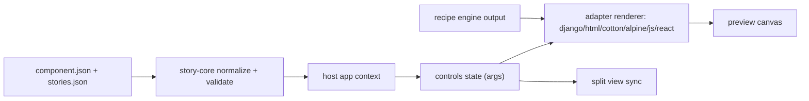

# Architecture

## Design principles

- Contract-first: schemas before adapters.
- Adapter-thin: framework-specific layers should map, not redefine.
- Shared-state preview: controls, args, and zoom are synchronized.
- Recipe-first styling: variants and tokens are centralized.

## Core contracts

### `component.json`

```json
{
  "slug": "button",
  "label": "Button",
  "type": "component",
  "order": 100,
  "stories": "stories.json",
  "cotton": {
    "template": "ds/button/index.html",
    "controls": "stories/controls.json"
  },
  "react": {
    "preview": "stories/react.preview.ts"
  }
}
```

### `stories.json`

```json
[
  {
    "slug": "default",
    "name": "Default",
    "template": "cotton/ds/button/stories/button.html",
    "defaults": {
      "label": "Click me",
      "variant": "primary"
    },
    "controls": ["label", "variant"]
  }
]
```

## Runtime layers

1. Host app layer (Django): routing, catalog loading, template context, mode controls.
2. Story core layer: parses and validates metadata + controls contract.
3. Adapter layer: renderer-specific mapping for Django/HTML/Cotton/Alpine/JS/React.
4. Runtime bridge layer: shared args synchronization and preview mount/unmount behavior.
5. Recipe engine layer: class generation and CSS token distribution.

## Data flow



## Adapter boundary

Each adapter consumes normalized input:

- `component`
- `story`
- `args`
- `controls schema`
- `render context` (portal container, callbacks)

Each adapter returns:

- Render result (template output, DOM output, or framework VDOM)
- Optional interaction hooks for args synchronization

## Split view contract

Split mode must guarantee:

- Shared `args` object between both panes.
- Deterministic arg update ordering.
- Identical default arg hydration.
- Independent mount roots with synchronized state.

See [`docs/SPLIT_VIEW.md`](SPLIT_VIEW.md).

## Recipe engine boundary

The recipe engine owns:

- Variant schema normalization
- Class name generation policy
- Token mapping to CSS custom properties
- Deterministic output ordering

Adapters should only consume generated classes and attributes.

See [`docs/RECIPES.md`](RECIPES.md).

## Testing strategy

- Contract tests for metadata validation.
- Adapter parity snapshots for shared stories.
- Interaction tests for controls synchronization.
- Split view regression tests for zoom, overlays, and focus.
- Recipe generation tests for variant and compound-variant behavior.

## Performance considerations

- Lazy-load adapter runtime where possible.
- Cache catalog parsing in host app.
- Reuse mount roots in preview runtime.
- Avoid heavy re-render loops on args changes.
