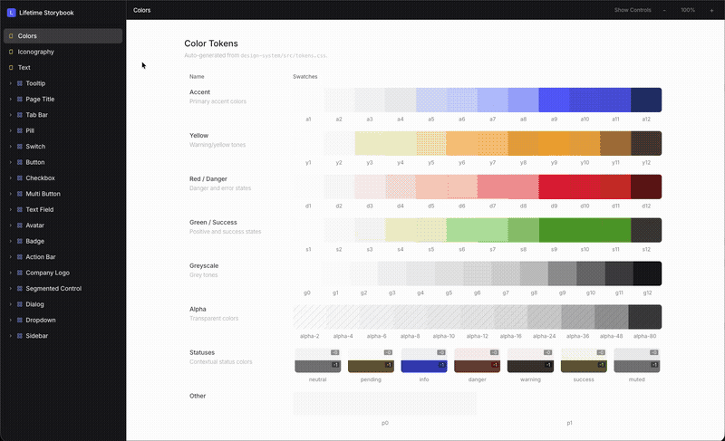

# Django Showroom

A Django-native Storybook JS alternative for building design systems. Develop, document, and test atomic UI components in isolation – with multi-framework rendering, shared story contracts, and side-by-side comparison.

## Why this project

Most teams with Django + frontend islands struggle with two recurring issues:

1. **Story drift** across rendering frameworks.
2. **Styling drift** across implementations.

This architecture solves both by making contracts and styling framework-agnostic first, then implementing thin adapters.

Works with any Django template approach — the included examples use [Django Cotton](https://django-cotton.com/) and [Alpine.js](https://alpinejs.dev/) for component encapsulation and interactivity, but plain Django templates and vanilla HTML work just as well.

## How it differs from Storybook.js

| | Django Showroom | storybook-django (Torchbox) |
|---|---|---|
| **Architecture** | Django-native – single server | Storybook.js wrapper – requires Django + Node servers |
| **Story format** | JSON contracts (`component.json`, `stories.json`) | JavaScript CSF (Component Story Format) |
| **Multi-framework** | Cotton, React, Alpine, HTML, vanilla JS – simultaneously | Django templates only (rendered via API) |
| **Split view** | Built-in side-by-side framework comparison | Not available |
| **Design tokens** | Built-in recipe engine for variants and CSS tokens | External (BYO) |
| **Focus** | Atomic design system components | Template previews |

## Example components

The repo ships with 3 example components demonstrating a complexity gradient:

- **Button** – simple, static component with variant/size controls
- **Badge** – medium complexity with data-attribute-driven styling
- **Text Field** – complex form input with label, icons, error states

Each component includes a `component.json` contract, stories, controls, a Cotton template, and a React preview – showing how one story definition renders identically across frameworks.

## Next steps

- [Installation & Getting Started](getting-started.md)
- [Architecture Overview](ARCHITECTURE.md)
- [Contracts Reference](CONTRACTS.md)
- [Adding Components](ADDING_COMPONENTS.md)
